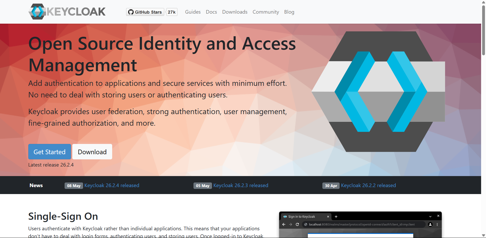
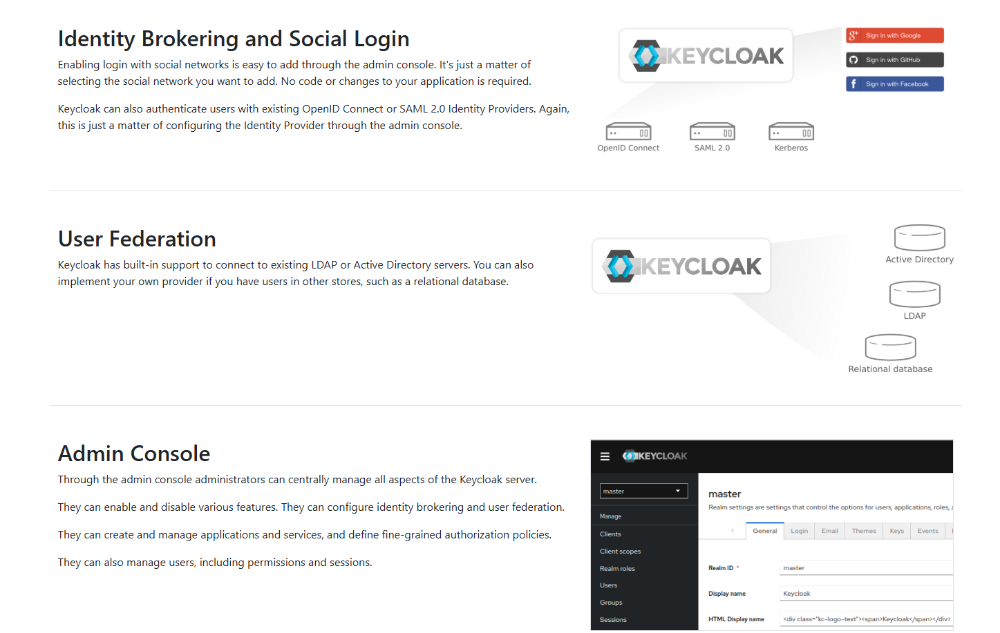

# KeycloackFastApi

[Keycloak](https://www.keycloak.org/)





**Keycloak** — это программное обеспечение с открытым исходным кодом для управления идентификацией и доступом (`IAM`), разработанное компанией `Red Hat`

Оно предоставляет инструменты для аутентификации и авторизации пользователей в приложениях и сервисах.

`Keycloak` поддерживает различные протоколы аутентификации, такие как `OAuth2`, `OpenID Connect` и `SAML 2.0`, и может интегрироваться с различными системами и приложениями для обеспечения безопасности и управления доступом.

## Основные компоненты Keycloak

**Перед тем как мы перейдем к практике, давайте кратко рассмотрим основные компоненты и термины, которые нам понадобятся:**

- `Realm (Реалм)` — изолированная область, в которой определяются пользователи, клиенты, роли и группы. Можно создавать несколько реалмов для разных проектов или окружений.

- `Client (Клиент)` — приложение, которое может запрашивать аутентификацию у `Keycloak` (в данном случае клиентом будет FastAPI-приложение)

- `User (Пользователь)` — субъект, который может аутентифицироваться в `Keycloak`

- `Role (Роль)` — набор прав, которые могут быть назначены пользователям. Роли могут быть привязаны к конкретному клиенту или быть глобальными для реалма.

- `Group (Группа)` — набор пользователей, которым можно одновременно назначить определенные роли.

- `Protocol (Протокол)` — `Keycloak` поддерживает несколько протоколов аутентификации, включая `OpenID Connect (расширение OAuth 2.0)` и `SAML 2.0`(в данном проекте мы будем использовать `OpenID Connect`).

### Поднимаем сам Keycloak

**Для развертывания `Keycloak` вам потребуется выполнить следующие шаги:**

1. **Создаем проект:**

- - `Тип`: Преднастроенное приложение из маркетплейса
- - `Параметры сервиса`: Авторизация
- - `Тип сервиса`: `Keycloak`
- - `Тариф`: не ниже «Начальный» для стабильной работы

2. **На этапе «Конфигурация» настраиваем переменные окружения (`envvars`):**

- - `KC_BOOTSTRAP_ADMIN_USERNAME` — имя (`login`) администратора
- - `KC_BOOTSTRAP_ADMIN_PASSWORD` — временный пароль администратора
- - `KC_DB` — тип базы данных. Указываем `postgres`
- - `KC_DB_URL_HOST` — host базы данных (тут задается ссылка для чтения/записи)
- - `KC_DB_URL_PORT` — порт базы данных (по умолчанию `5432` для `PostgreSQL`, если поднимали на `Amvera`)
- - `KC_DB_URL_DATABASE` — имя базы данных
- - `KC_DB_USERNAME` — имя пользователя базы данных
- - `KC_DB_PASSWORD` — пароль базы данных

3. **В разделе «Настройки» приложения:**

- - Активируем бесплатное доменное имя или добавляем своё

4. **Добавляем переменную:**

- - `KC_HOSTNAME` — ваше доменное имя

---

💼 **Автор:** Дуплей Максим Игоревич

📲 **Telegram:** @quadd4rv1n7

📅 **Дата:** 10.05.2025

▶️ **Версия 1.0**

```textline
※ Предложения по сотрудничеству можете присылать на почту ※
📧 maksimqwe42@mail.ru
```
